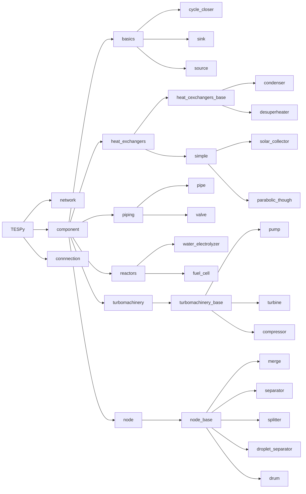
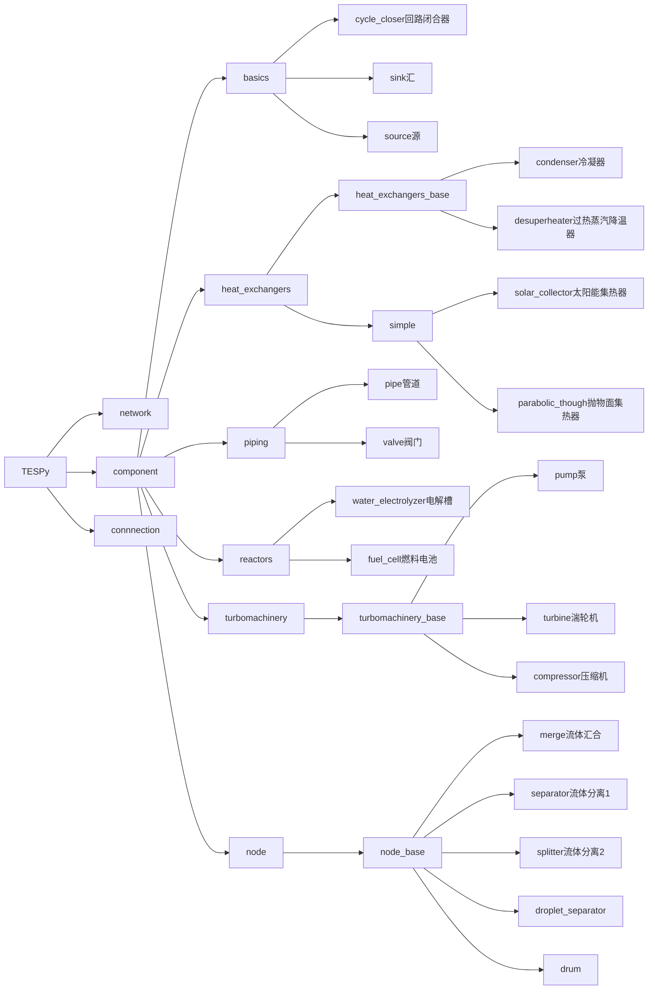

```mermaid
graph LR;
    TESPy --> network;
    TESPy --> component;
    TESPy --> connnection;
    component --> basics;
    component --> heat_exchangers;
    component --> piping;
    component --> reactors;
    component --> turbomachinery;
    component --> node;


    basics --> cycle_closer;
    basics --> sink;
    basics --> source;

    heat_exchangers --> heat_cexchangers_base;
    heat_cexchangers_base --> condenser;
    heat_cexchangers_base --> desuperheater;

    heat_exchangers --> simple;
    simple --> solar_collector;
    simple --> parabolic_though;

    piping --> pipe;
    piping --> valve;

    reactors --> water_electrolyzer;
    reactors --> fuel_cell;

    turbomachinery --> turbomachinery_base;
    turbomachinery_base --> pump;
    turbomachinery_base --> turbine;
    turbomachinery_base --> compressor;

    node --> node_base;
    node_base --> merge;
    node_base --> separator;
    node_base --> splitter;
    node_base --> droplet_separator;
    node_base --> drum;
```

``` mermaid
graph LR;
    TESPy --> network;
    TESPy --> component;
    TESPy --> connnection;
    component --> basics;
    component --> heat_exchangers;
    component --> piping;
    component --> reactors;
    component --> turbomachinery;
    component --> node;

    basics --> cycle_closer回路闭合器;
    basics --> sink汇;
    basics --> source源;

    heat_exchangers --> heat_exchangers_base;
    heat_exchangers_base --> condenser冷凝器;
    heat_exchangers_base --> desuperheater过热蒸汽降温器;

    heat_exchangers --> simple;
    simple --> solar_collector太阳能集热器;
    simple --> parabolic_though抛物面集热器;

    piping --> pipe管道;
    piping --> valve阀门;

    reactors --> water_electrolyzer电解槽;
    reactors --> fuel_cell燃料电池;

    turbomachinery --> turbomachinery_base;
    turbomachinery_base --> pump泵;
    turbomachinery_base --> turbine湍轮机;
    turbomachinery_base --> compressor压缩机;

    node --> node_base;
    node_base --> merge流体汇合;
    node_base --> separator流体分离1;
    node_base --> splitter流体分离2;
    node_base --> droplet_separator;
    node_base --> drum;
```