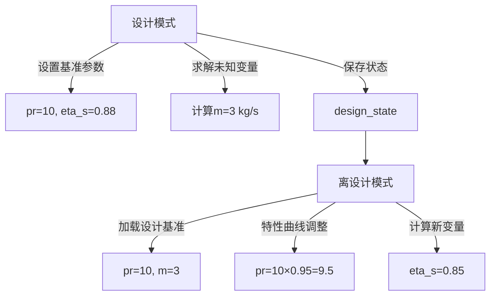

# TESPy 设计模式与离设计模式

---

## 核心概念对比

| **维度**         | **设计模式（Design）** | **离设计模式（Offdesign）** |
|------------------|-------------------------------------------------------|-----------------------------------------------------|
| **目的**         | 建立系统在额定工况下的参数基准                          | 分析系统在变工况下的动态行为                          |
| **参数行为**     | 显式参数固定为设计值（如`pr=10`）                       | 参数基于设计基准和特性曲线动态调整                    |
| **求解逻辑**     | 通过方程平衡确定未知变量（流量、温度等）                  | 基于设计基准值和特性曲线调整参数                      |
| **典型场景**     | 系统初始设计（压缩机压力比、燃烧室效率等）                | 部分负载运行、环境参数变化、设备老化分析              |

key:

- **Design模式**：定义系统在理想条件下的基准参数，用于建立初始模型。
- **Offdesign模式**：基于设计点数据，通过特性曲线或公式模拟实际运行中的参数变化，适用于动态分析。
  
---

## 参数行为规则

### 1. 设计模式参数设置
```python
# 显式声明设计参数（基准值固定）
c.set_attr(
    pr=10,                  # 设计压力比
    eta_s=0.88,             # 设计等熵效率
    design=['pr', 'eta_s'], # 声明需固定的设计参数
    offdesign=['char_map_pr', 'char_map_eta_s']  # 离设计参数调整方式
)
nw.solve('design')  # 求解设计工况
```
- **行为特征**：
  - `pr=10`和`eta_s=0.88`成为固定基准值
  - 未设置参数（如质量流量`m`）由求解器计算得出

### 2. 离设计模式参数调整
```python
# 基于设计基准进行变工况计算
nw.solve('offdesign', design_path='design_state')  # 必须关联设计点
```
- **动态调整原理**：
  - 从`design_state`加载基准参数（如`pr=10`）
  - 通过特性曲线计算实际值（如`pr_offdesign = 10 × 0.95`）

---

## 关键机制说明

### 参数继承与覆盖
| **参数类型**       | 设计模式行为                          | 离设计模式行为                          |
|--------------------|-------------------------------------|----------------------------------------|
| 显式设计参数       | 固定为设定值（如`pr=10`）             | 按特性曲线调整（如`char_map_pr`）        |
| 隐式设计参数       | 自动成为基准值（如`m=3`）              | 可覆盖为新值（如`m=2.5`）                |
| 未声明参数         | 可能成为求解变量                      | 默认保持固定                            |

### 参数修改规则
```python
# 第一次设计计算
c.set_attr(pr=10)
nw.solve('design')  # pr=10生效

# 第二次设计计算（参数覆盖）
c.set_attr(pr=12)   # 显式覆盖
nw.solve('design')  # pr=12生效
```

---

## 典型应用场景

### 设计模式应用
```python
# 确定燃烧室额定工况参数
comb.set_attr(lamb=2)  # 固定过剩空气系数
```

### 离设计模式应用
```python
# 变负荷工况设置
ct.set_attr(T=1100)      # 覆盖涡轮出口温度
power.set_attr(P=-8e5)   # 设置新功率目标
```

---

## 工作流程示意图



---

## 代码流程示意图

```text
设计模式 (nw.solve('design'))
|
├─ 设置基准参数（pr=10, eta_s=0.88）
├─ 计算未设置的变量（如流量m=3 kg/s）
└─ 保存设计状态（nw.save('design_state')）
|
↓
离设计模式 (nw.solve('offdesign', design_path='design_state'))
|
├─ 加载设计基准值（pr=10, m=3）
├─ 根据特性曲线调整参数（如pr=10 × 0.95）
└─ 计算新工况下的变量（如效率eta_s=0.85）
```

---

## 核心文件依赖

```text
design_state/
├── components/
│   ├── Compressor.json
│   └── Turbine.json
├── connections.json
├── busses.json
└── network.json
```

---

## 注意事项

1. **设计点保存必要性**  
   离设计计算必须通过`nw.save()`保存设计状态，否则无法加载基准参数

2. **特性曲线归一化**  
   所有特性曲线参数均以设计值为基准进行无量纲化计算

3. **变量声明规则**  
   需通过`参数='var'`显式声明可调变量：

   ```python
   c.set_attr(igva='var')  # 允许调整导向叶片角度
   ```

4. **模式切换原则**  
   
   ```python
   # 正确模式切换流程
   nw.solve('design')
   nw.save('design_state')
   nw.solve('offdesign', design_path='design_state')  # ✅ 正确

   # 错误用法（缺少设计基准）
   nw.solve('offdesign')  # ❌ 将导致计算异常
   ```